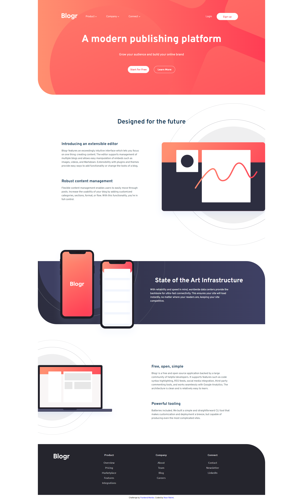

# Frontend Mentor - Blogr landing page solution

This is a solution to the [Blogr landing page challenge on Frontend Mentor](https://www.frontendmentor.io/challenges/blogr-landing-page-EX2RLAApP). Frontend Mentor challenges help you improve your coding skills by building realistic projects.

## Table of contents

- [Overview](#overview)
  - [The challenge](#the-challenge)
  - [Screenshot](#screenshot)
  - [Links](#links)
- [My process](#my-process)
  - [Built with](#built-with)
  - [What I learned](#what-i-learned)
  - [Useful resources](#useful-resources)
- [Author](#author)

## Overview

### The challenge

Users should be able to:

- View the optimal layout for the site depending on their device's screen size
- See hover states for all interactive elements on the page

### Screenshot

### Links

- Solution URL: [solution](https://github.com/rahmi1016/blogr-landing-page-scss/)
- Live Site URL: [live site](https://rahmi1016.github.io/blogr-landing-page-scss/)

## My process

### Built with

- Semantic HTML5 markup
- CSS custom properties
- Flexbox
- Mobile-first workflow
- [SASS](https://sass-lang.com/) - For styles

### What I learned

Mostly about background-images in css

### Useful resources

- [How TO - Responsive Navbar with Dropdown](https://www.w3schools.com/howto/howto_js_responsive_navbar_dropdown.asp)
- [CSS background-image Property](https://www.w3schools.com/cssref/pr_background-image.php)
- [How do I combine a background-image and CSS3 gradient on the same element?](https://stackoverflow.com/questions/2504071/how-do-i-combine-a-background-image-and-css3-gradient-on-the-same-element)
- [CSS background-position Property](https://www.w3schools.com/cssref/pr_background-position.php)
- [How TO - Media Queries with JavaScript](https://www.w3schools.com/howto/howto_js_media_queries.asp)

## Author

- Frontend Mentor - [@rahmi1016](https://www.frontendmentor.io/profile/rahmi1016)
